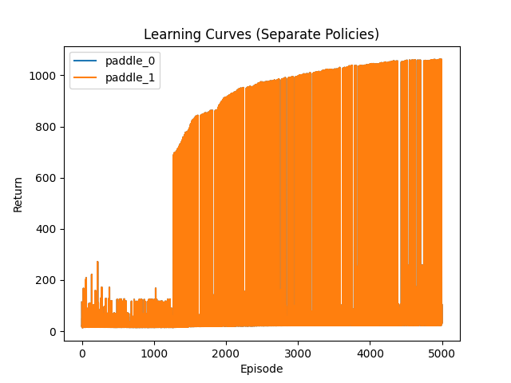

# Sprawozdanie: Uczenie wieloagentowe w środowisku cooperative_pong_v5

Michał Burda

Kamil Poniewierski

## 1. Wstęp
Celem eksperymentu było zaimplementowanie i przetestowanie uczenia wieloagentowego w środowisku `cooperative_pong_v5` z biblioteki PettingZoo. Każdy z agentów steruje własną paletką w grze Pong i współpracuje, aby jak najdłużej odbijać piłkę.

## 2. Implementacja

### Środowisko
Wykorzystano środowisko `cooperative_pong_v5` z PettingZoo, które zostało poddane preprocessingowi za pomocą SuperSuit:
- konwersja do skali szarości (`color_reduction_v0`),
- zmiana rozmiaru obserwacji do 84x84 pikseli (`resize_v1`),
- stackowanie 4 ostatnich klatek (`frame_stack_v1`).

### Architektura agenta
Każdy agent posiada własną sieć neuronową typu CNN (Convolutional Neural Network) zbudowaną z trzech warstw konwolucyjnych, warstwy spłaszczającej oraz gęstej warstwy ukrytej. Sieć posiada dwie głowice:
- aktora (policy head) – zwraca rozkład prawdopodobieństwa akcji,
- krytyka (value head) – estymuje wartość stanu.

### Algorytm
Zaimplementowano niezależne uczenie PPO (Proximal Policy Optimization) dla każdego agenta (każda paletka ma osobną politykę i optymalizator). Uczenie odbywa się w pętli epizodów:
- Zbierane są trajektorie dla obu agentów.
- Po zebraniu batcha epizodów wykonywana jest aktualizacja wag sieci (policy gradient + value loss + entropy bonus).
- Wprowadzono:
  - normalizację i klipowanie nagród,
  - silniejszy bonus entropijny (wspomaga eksplorację),
  - batchowe aktualizacje (większa stabilność).

## 3. Eksperyment

### Parametry
- Liczba epizodów: 5000
- Rozmiar batcha: 8 epizodów
- Współczynnik entropii: 0.05
- Gamma: 0.99
- Optymalizator: Adam, lr=2.5e-4

### Przebieg uczenia
Na początku agenci działają losowo i rzadko odbijają piłkę. Dzięki eksploracji i normalizacji nagród, z czasem uczą się skuteczniej współpracować. Po kilku tysiącach epizodów średnia suma nagród rośnie, co widać na wykresie learning curve.

### Wyniki
Wyniki uczenia przedstawia poniższy wykres:

Widać wyraźny wzrost skuteczności agentów – po ok. 2000 epizodów agenci regularnie odbijają piłkę i utrzymują ją w grze przez dłuższy czas.

## 4. Wnioski
- Uczenie wieloagentowe w środowisku z rzadkimi nagrodami wymaga silnej eksploracji i odpowiedniego preprocessingu nagród.
- Batchowe aktualizacje i normalizacja nagród znacząco poprawiają stabilność i efektywność uczenia.
- Prosty PPO z niezależnymi politykami pozwala nauczyć agentów skutecznej współpracy w Pongu.

## 5. Kod
Kod źródłowy znajduje się w pliku `main.py` w katalogu `lab06`.
